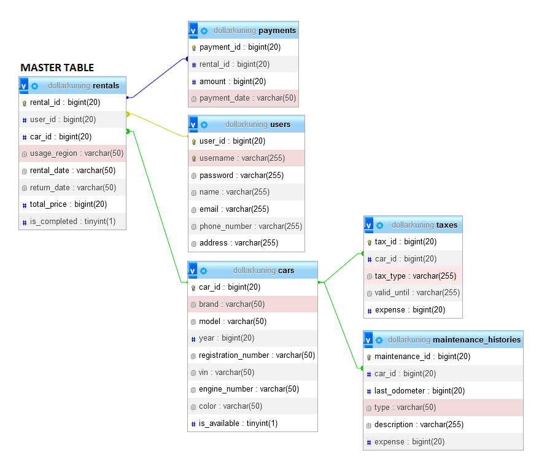

# FinalProject_Rental-Car-Management

Proyek Manajemen Persewaan Mobil adalah aplikasi CRUD sederhana yang dibangun menggunakan bahasa pemrograman Go (Golang) dengan menggunakan framework Gin dan GORM untuk mengelola data persewaan mobil. Aplikasi ini memungkinkan pengguna untuk melakukan operasi dasar seperti membuat, membaca, memperbarui, dan menghapus data pada berbagai entitas yang terkait dengan persewaan mobil.

## Fitur
- Pengelolaan riwayat pemeliharaan mobil
- Pengelolaan data pajak mobil
- Pengelolaan data pengguna
- Pengelolaan data mobil
- Pengelolaan data persewaan
- Pengelolaan data pembayaran

## Desain Database



## Struktur Direktori

- `main.go`: File utama yang berisi inisialisasi aplikasi dan routing.
- `controller/`: Direktori yang berisi file-file controller untuk setiap entitas.
- `database/`: Direktori yang berisi fungsi untuk menghubungkan ke database.
- `middleware/`: Direktori yang berisi fungsi untuk kemananan routing.
- `models/`: Direktori yang berisi file-file model untuk setiap entitas.
- `utils/`: Direktori yang berisi fungsi tambahan untuk proyek.
- `others/`: Direktori yang mendukukng proyek ini, misalnya file postman, database, dll.
- `README.md`: File yang berisi dokumentasi proyek.

## Instalasi dan Penggunaan

1. Pastikan Anda memiliki Go (Golang) yang terinstal di komputer Anda.
2. Clone repositori ini ke direktori lokal Anda.
```
git clone https://github.com/denyandriawan01/FinalProject_Rental-Car-Management
```
3. Buka terminal dan navigasikan ke direktori proyek.
```
cd FinalProject_Rental-Car-Management
```
4. Jalankan perintah `go mod tidy` untuk mengunduh dependensi yang diperlukan.
5. Konfigurasi koneksi database pada file `database/database.go`.
6. Buatlah juga sebuah database dengan nama yang sudah disesuaikan pada file `.env`.
7. Jalankan perintah `go run main.go` atau `go run .` untuk menjalankan aplikasi.
8. Aplikasi akan berjalan di `http://localhost:8080/` {enpoint}.

## API Endpoints
Berikut adalah daftar API endpoints yang tersedia:

```plaintext
### Izin Akses Masuk

- `POST /api/users`: Membuat data user login baru.
- `POST /api/users/login`: Membuat permintaan login.
- `POST /api/users/logout`: Membuat permintaan logout.

### Data Mobil

- `GET /api/cars`: Mengambil daftar data mobil.
- `GET /api/cars/:id`: Mengambil detail data mobil berdasarkan ID.
- `POST /api/cars`: Membuat data mobil baru.
- `PUT /api/cars/:id`: Memperbarui data mobil berdasarkan ID.
- `DELETE /api/cars`: Menghapus data mobil berdasarkan ID.

### Riwayat Pemeliharaan Mobil

- `GET /api/maintenance`: Mengambil daftar riwayat pemeliharaan mobil.
- `GET /api/maintenance/:id`: Mengambil detail riwayat pemeliharaan mobil berdasarkan ID.
- `POST /api/maintenance`: Membuat riwayat pemeliharaan mobil baru.
- `PUT /api/maintenance/:id`: Memperbarui riwayat pemeliharaan mobil berdasarkan ID.
- `DELETE /api/maintenance`: Menghapus riwayat pemeliharaan mobil berdasarkan ID.

### Data Pembayaran

- `GET /api/payments`: Mengambil daftar data pembayaran.
- `GET /api/payments/:id`: Mengambil detail data pembayaran berdasarkan ID.
- `POST /api/payments`: Membuat data pembayaran baru.
- `PUT /api/payments/:id`: Memperbarui data pembayaran berdasarkan ID.
- `DELETE /api/payments`: Menghapus data pembayaran berdasarkan ID.

### Data Persewaan

- `GET /api/rentals`: Mengambil daftar data persewaan.
- `GET /api/rentals/:id`: Mengambil detail data persewaan berdasarkan ID.
- `POST /api/rentals`: Membuat data persewaan baru.
- `PUT /api/rentals/:id`: Memperbarui data persewaan berdasarkan ID.
- `DELETE /api/rentals`: Menghapus data persewaan berdasarkan ID.

### Data Pajak Mobil

- `GET /api/taxes`: Mengambil daftar data pajak mobil.
- `GET /api/taxes/:id`: Mengambil detail data pajak mobil berdasarkan ID.
- `POST /api/taxes`: Membuat data pajak mobil baru.
- `PUT /api/taxes/:id`: Memperbarui data pajak mobil berdasarkan ID.
- `DELETE /api/taxes`: Menghapus data pajak mobil berdasarkan ID.

### Data Pengguna

- `GET /api/users`: Mengambil daftar data pengguna.
- `GET /api/users/:id`: Mengambil detail data pengguna berdasarkan ID.
- `POST /api/users`: Membuat data pengguna baru.
- `PUT /api/users/:id`: Memperbarui data pengguna berdasarkan ID.
- `DELETE /api/users`: Menghapus data pengguna berdasarkan ID.

```

## Contoh Input (Postman)

1. Mengambil daftar data mobil (GET /api/cars):
Tidak memerlukan input. Hanya perlu mengirim permintaan GET ke endpoint /api/cars.

2. Mengambil detail data mobil berdasarkan ID (GET /api/cars/:id):
Ganti {id} dengan ID mobil yang ingin Anda dapatkan. Kirim permintaan GET ke endpoint /api/cars/{id}.

Membuat data mobil baru (POST /api/cars):
Kirimkan body JSON dengan informasi mobil yang ingin Anda tambahkan. Contoh:

```plaintext
{
  "brand": "Toyota",
  "model": "Camry",
  "year": 2022,
  "registration_number": "AB123CD",
  "vin": "1HGCM82633A123456",
  "engine_number": "ENG123456789",
  "color": "Black",
  "is_available": true
}
```

4. Memperbarui data mobil berdasarkan ID (PUT /api/cars/:id):
Ganti {id} dengan ID mobil yang ingin Anda perbarui. Kirimkan body JSON dengan informasi mobil yang ingin diperbarui. Contoh:
```plaintext
{
  "brand": "Toyota",
  "model": "Camry",
  "year": 2023,
  "registration_number": "AB456EF",
  "vin": "1HGCM82633A654321",
  "engine_number": "ENG987654321",
  "color": "White",
  "is_available": false
}
```

5. Menghapus data mobil berdasarkan ID (DELETE /api/cars):
Kirim body JSON dengan ID mobil yang ingin dihapus. Contoh:
```plaintext
{
  "id": 123
}
```
Ganti 123 dengan ID mobil yang ingin Anda hapus.